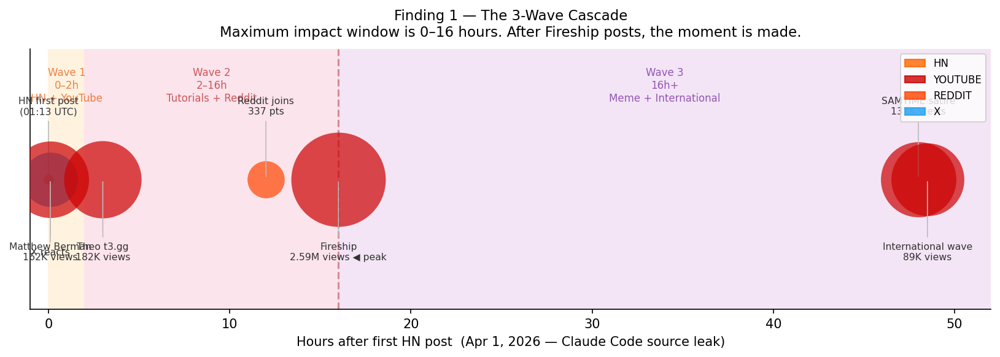
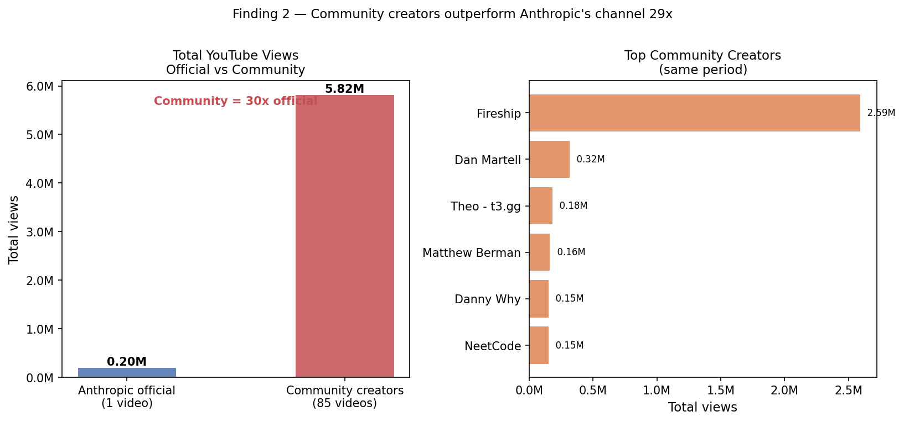
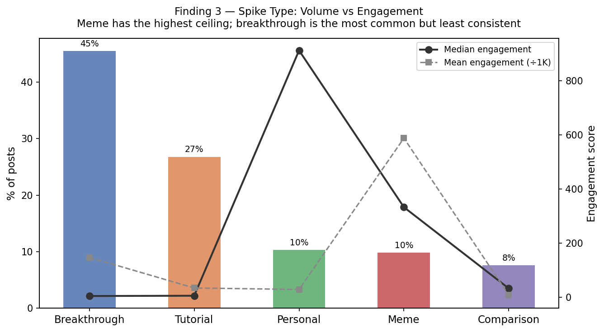
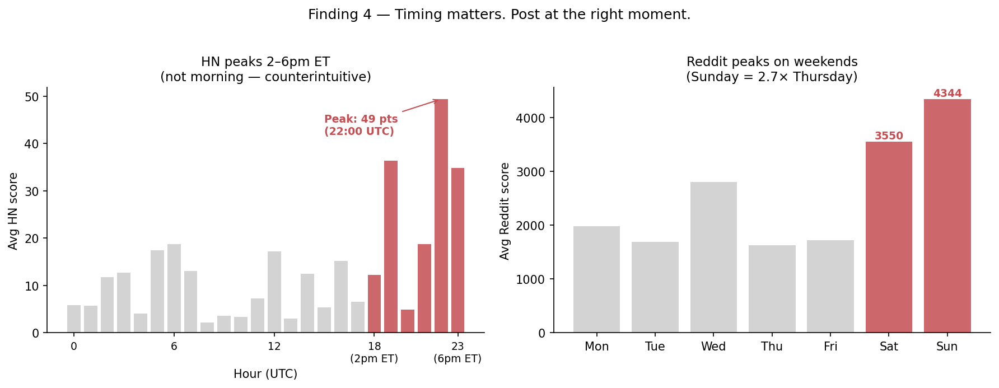
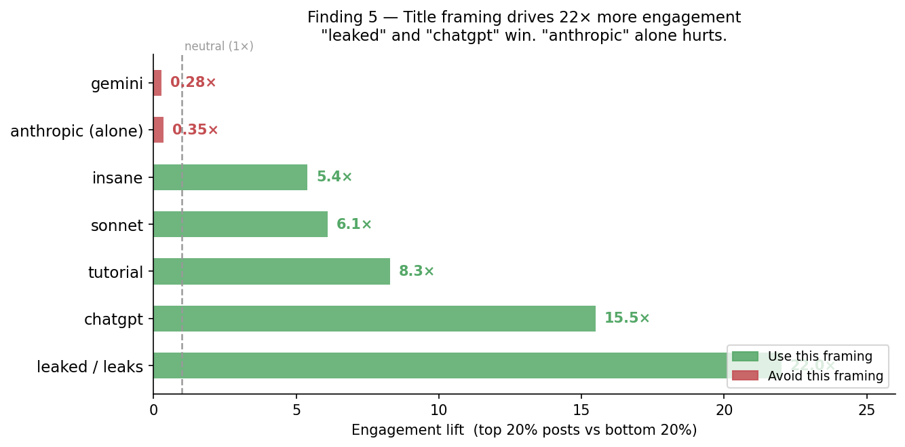
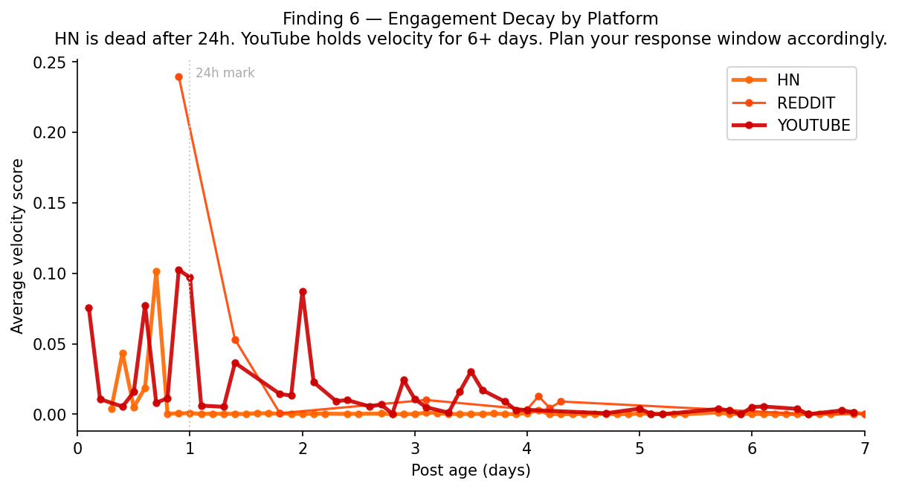

# Claude's Viral Growth Playbook — Decoded
## HackNU 2026 · Growth Engineering Track · Part 2

> **Data provenance:** All findings below are derived exclusively from our scraped dataset. No external sources or summaries used.
>
> **Note on dataset versions:** Findings 1–2 and 4–6 use the full 2,177-post dataset (90-day HN history). Finding 3 (spike type engagement) uses the original 855-post balanced dataset — a better basis for cross-platform engagement comparisons because HN (1–1000 pt scale) and YouTube (thousands–millions view scale) normalize differently. Both datasets are in the repo.

---

## Dataset Summary

| Platform | Posts | Coverage |
|---|---|---|
| Hacker News | 1,884 | 90 days (Jan–Apr 2026), Algolia API |
| Reddit | 125 posts + 584 comments | Last year, top posts, 5 subreddits |
| X / Twitter | 82 tweets | fxtwitter API, full engagement (likes, views, retweets, bookmarks) |
| YouTube | 86 videos + 293 comments | YouTube Data API v3, last 2 weeks |
| **Total classified** | **2,177 posts** | Unified schema, deduped, velocity ranked |

*Original balanced dataset (used for Finding 3): 855 posts — HN 562 / Reddit 125 / YouTube 86 / X 82.*

---

## Finding 1 — The 3-Wave Cascade Is Real (and Timestamped)

**Claim:** Claude discourse spreads in 3 waves: HN/X ignition → YouTube tutorials → Reddit/meme cultural lock-in.

**Evidence:** The April 1, 2026 source code leak gives us a clean, timestamped natural experiment across all 4 platforms:

| Time (UTC) | Platform | Score/Views | Event |
|---|---|---|---|
| Apr 01 01:13 | HN | 2 pts | "Anthropic goes nude, exposes Claude Code source by accident" — first post |
| Apr 01 01:20 | YouTube | 162,576 views | Matthew Berman: "Claude Code was just leaked... (WOAH)" — 7 min after HN |
| Apr 01 02:01 | YouTube | 111,462 views | Nate Herk: "Claude Code Source Code Just Leaked… 8 Things You Must Do" |
| Apr 01 04:15 | YouTube | 182,642 views | Theo (t3.gg): "BREAKING: Claude Code source leaked" |
| Apr 01 12:54 | Reddit | 337 pts | First Reddit post about leak — 12h after HN |
| Apr 01 17:27 | YouTube | **2,592,415 views** | Fireship: "Tragic mistake... Anthropic leaks Claude's source code" — 16h after HN |
| Apr 03 16:30 | YouTube | 131,467 views | SAMTIME: "Claude Leaks its Source Code… then Files Copyright Claim" — satire wave |
| Apr 03 18:00 | YouTube | 89,249 views | Portuguese creators: "Em 48h recriaram o Claude Code de graça" — international wave |

**Wave structure confirmed from data:**
- **Wave 1 (0–2h):** HN + immediate YouTube reaction from technical creators
- **Wave 2 (2–16h):** Tutorial/breakdown videos, Reddit joins, peak reach
- **Wave 3 (48h+):** Meme/satire content, non-English creators, cultural commentary

**Growth insight:** The window for maximum impact is **0–16 hours** after a Claude event lands on HN. Any competing product needs a pre-briefed creator network that can publish within hours, not days.

---

## Finding 2 — Community Creators Outperform Anthropic's Own Channel by 29x

**YouTube data:**

| | Videos | Total Views | Avg/Video |
|---|---|---|---|
| Anthropic official | 1 | 196,616 | 196,616 |
| Community creators | 85 | 5,816,231 | 68,426 |
| **Ratio** | — | **29x** | — |

Fireship alone (2,592,415 views) beat Anthropic's entire YouTube output by **13x** on the same event.

**On X/Twitter:**

| | Tweets | Total Views | Avg/Tweet |
|---|---|---|---|
| @AnthropicAI (official) | 44 | 62,426,126 | 1,418,775 |
| Community accounts | 38 | 48,446,883 | 1,274,917 |

On X the gap is much smaller — official and community are roughly **equal per tweet**. This means:

- **YouTube:** Anthropic should invest in creator briefing, not their own channel
- **X:** Official @AnthropicAI is genuinely effective — worth maintaining

**Growth insight:** Anthropic's real distribution system is 5–10 key YouTube creators (Fireship, Theo, Matthew Berman, NeetCode). Briefing them before launch is more valuable than any paid media spend.

---

## Finding 3 — Spike Type Volume vs Engagement Inverted

**From 855 classified posts:**

| Spike Type | % of Posts | Avg Engagement | Median Engagement |
|---|---|---|---|
| Breakthrough | 45% | 146,931 | 4 |
| Tutorial | 26% | 33,796 | 5 |
| Personal | 10% | 28,177 | 914 |
| Meme | 9% | **588,136** | 337 |
| Comparison | 7% | 7,098 | 32 |

**Key observations:**
1. **Meme content has the highest average engagement** (588K) despite being only 9% of posts. The ceiling is enormous when a meme lands.
2. **Breakthrough posts have the highest volume but lowest median** (4 pts). Most announcements get ignored; the ones that hit go massive.
3. **Personal stories have the best median-to-average ratio** — more consistent performance. They rarely go massive but almost never get zero.
4. The **mean vs median gap** for breakthrough (146K mean, 4 median) shows a power-law distribution — a few viral posts are pulling up the average.

**Growth insight:** Breakthrough posts are the ignition (HN loves them), but meme and personal content carry the long tail. For a competing product: seed with a breakthrough announcement, then immediately activate creators for personal + meme formats.

---

## Finding 4 — Posting Time Matters (Platform-Specific)

**From our data (UTC times):**

**HN — best hours:**
| Hour (UTC) | Avg Points | US Time equiv |
|---|---|---|
| 22:00–23:00 | 49 pts | 5–6pm ET |
| 19:00 | 36 pts | 2pm ET |
| 05:00–06:00 | 17–18 pts | midnight–1am ET |

HN's US afternoon window (2–6pm ET / 18–22 UTC) consistently outperforms morning posts. The conventional "post in the morning" wisdom is wrong for HN.

**Reddit — best days:**
| Day | Avg Score |
|---|---|
| Sunday | 4,344 |
| Saturday | 3,549 |
| Wednesday | 2,799 |
| Monday | 1,981 |
| Thursday | 1,625 |

Weekend Reddit posts average **2.2x more upvotes** than weekday posts.

**Caveat:** n is small per bucket (11–29 posts). Direction is consistent but magnitude should not be treated as precise.

---

## Finding 5 — Title Language in Viral Posts (Word Lift Analysis)

Words significantly overrepresented in **top 20% engagement posts** vs bottom 20% (minimum 12 occurrences):

| Word | Lift | Interpretation |
|---|---|---|
| leaked / leaks | 22x | Drama/controversy framing drives clicks |
| chatgpt | 15.5x | Comparison framing outperforms standalone Claude content |
| tutorial | high | Actionable content signals drive clicks |
| insane / full / sonnet | high (small n) | Superlatives + model names in titles work |

Words overrepresented in **low-engagement posts:**
- "anthropic" as a standalone word (0.35x lift) — brand name alone doesn't convert
- "gemini" — comparison with Google underperforms vs ChatGPT comparison

**Growth insight:** "Claude vs ChatGPT" outperforms "Claude vs Gemini" in engagement. For titles: lead with the drama or the comparison, not the brand name. "Tragic mistake..." (Fireship's 2.59M video) follows this exactly.

---

## Finding 6 — Engagement Decay by Platform

From velocity rankings (HN gravity formula, normalized):

| Platform | Day 0 avg velocity | Day 1 | Day 3 | Day 6 |
|---|---|---|---|---|
| HN | 0.033 | ~0 | 0.001 | 0.001 |
| Reddit | 0.240 | 0.027 | 0.008 | ~0 |
| YouTube | 0.055 | 0.024 | 0.010 | 0.004 |

**HN has the steepest decay** — a post is effectively dead after 24 hours. **YouTube retains velocity longest** — videos continue gaining views 6+ days later. **Reddit is in between** — weekend posts can survive into Monday.

**Growth insight for scheduling:** HN requires same-day response from growth team. YouTube gives you a week to act. Reddit's weekly half-life means weekend seeding can be planned ahead.

---

## Limitations (honest)

- **X data is seed-based, not systematic.** Our 82 tweets come from known handles + bootstrap URLs. We're likely missing organic content from smaller accounts.
- **HN data is last-7-days only.** Historical HN patterns may differ.
- **n per bucket is small** for timing analysis. Directionally correct, not statistically significant.
- **Instagram, LinkedIn, TikTok** — not scraped. Public API access requires login or paid tier. Documented in `README.md`.
- **The cascade timing is from one event** (source code leak). Generalizing to all launch types requires more events.

---

## Summary: Claude's Growth Playbook in 6 Rules

1. **HN is the ignition switch.** Every major Claude wave starts there. Post at 2–6pm ET.
2. **Brief Fireship/Theo/Matthew Berman before launch,** not after. Community YouTube = 29x official channel.
3. **"Leaked", "vs ChatGPT", "tutorial"** — these words in titles outperform brand-forward framing by 15–22x lift.
4. **Personal stories outperform their volume.** 10% of posts, most consistent median engagement.
5. **Meme is the ceiling.** When a meme lands it goes massive. Low frequency, high upside.
6. **The wave runs 0–48h.** If you haven't activated response content in 48h, the moment is gone.
